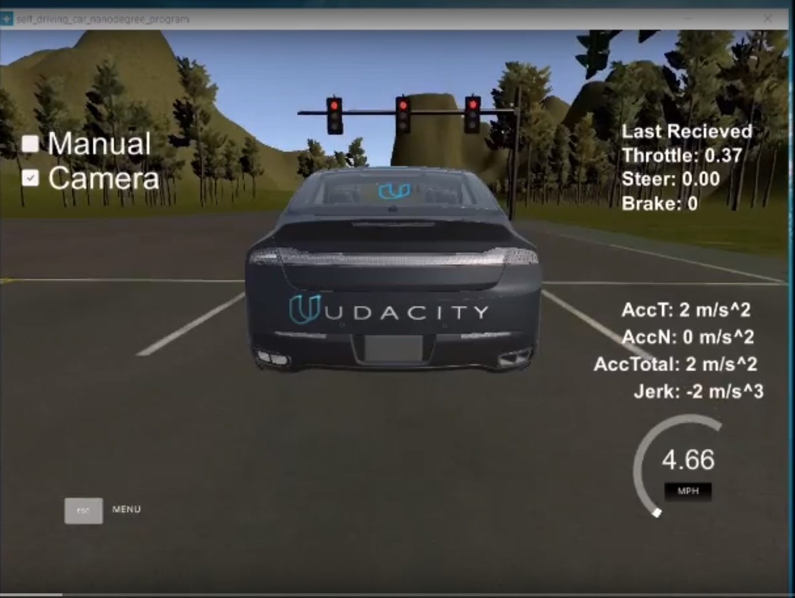
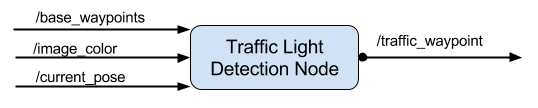
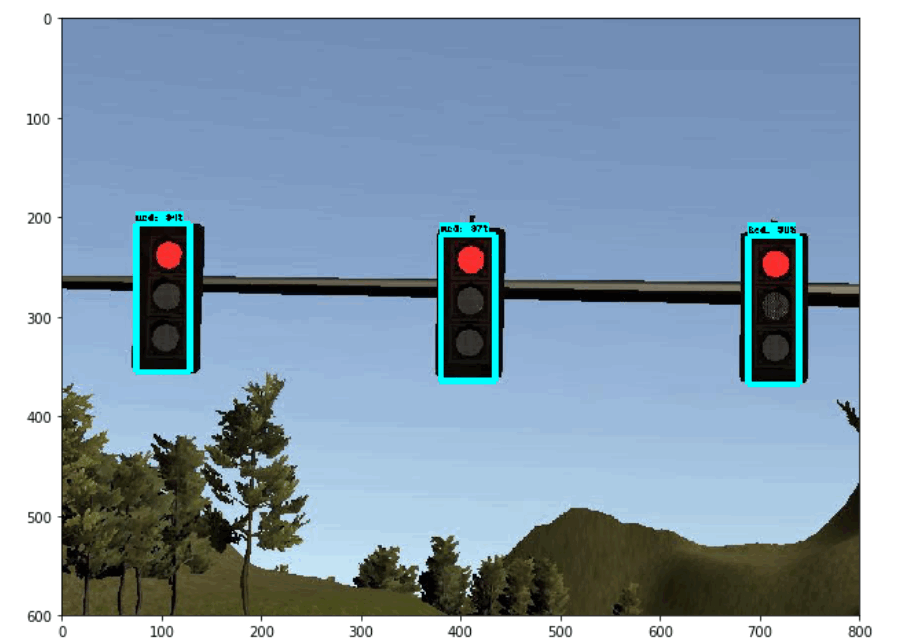
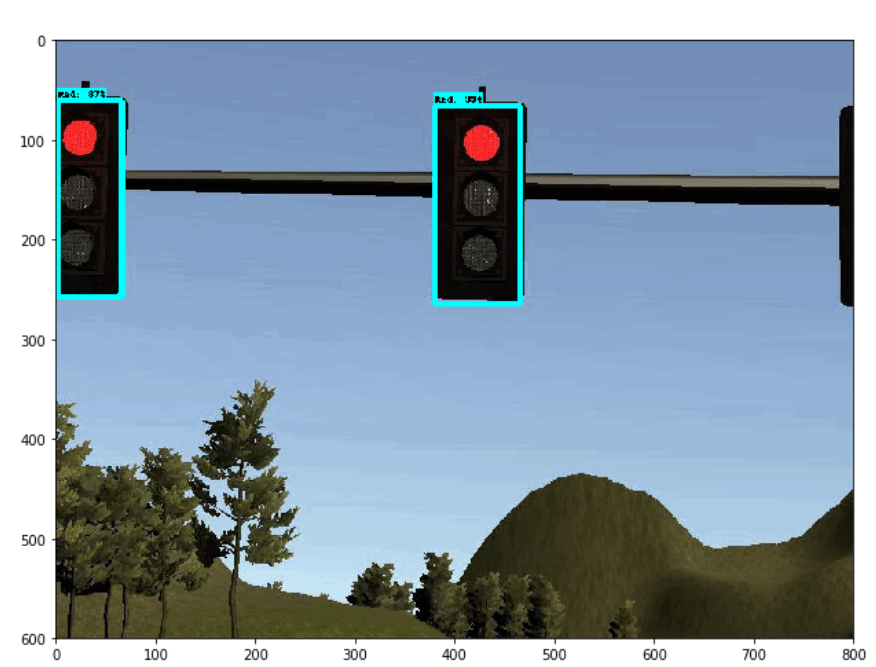
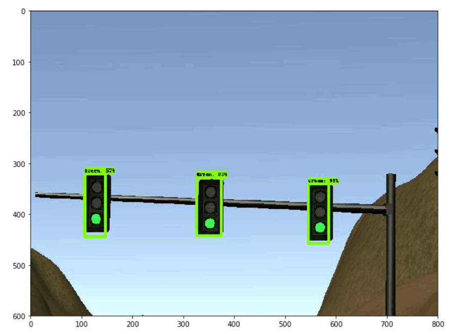
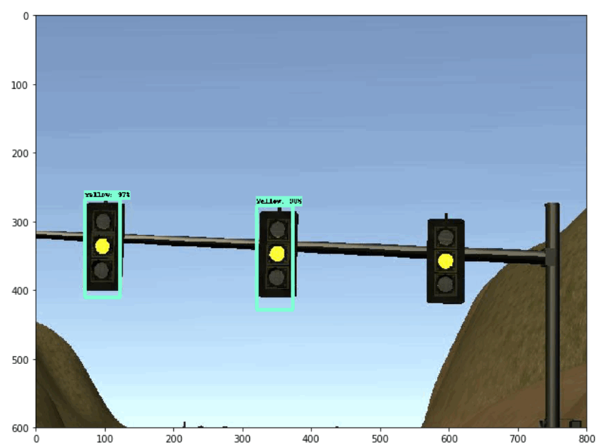
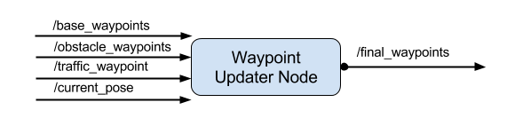
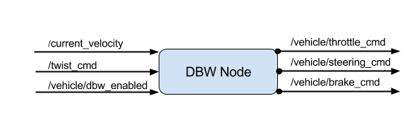

# Udacity Self-Driving Car Engineer Nanodegree


## Final Project - System Integration

## Team NinjaCar

[](https://www.youtube.com/watch?v=nnm6esR3pUk)

### Team Member
1. <b>Naushad Rahman, Email (naushad.rahman@hotmail.com) </b> 
2. <b>Satoshi Kumano, Email (satoshi.kumano@gmail.com) </b>
3. <b>Nghi Tran, Email (nathantran99@gmail.com) </b>

## Carnd-Capstone Project 
This is the Capstone project for the Udacity Self-Driving Car Nanodegree. We have devloped algorithm for 
<ul>
  <li><b>Traffic Light detection</b> </li>
  <li><b>Controlling Car to Follow Trjectory</b></li>
  <li><b>Controlling Car to stop on Traffic Light</b></li>
</ul>

We have implemented code in ROS(Robot Operating system) and tested with the Udacity build simulator .


## Project Components

### Traffic Light Detection 



In this node we have to build the Traffic light detection and classify the traffic light . As shown in the traffic light detector node , this node takes 

<ul>
<li> base waypoints</li>
<li> image color that is image from camera and this will only avilable if we check in the simulator</li>
<li>  current position </li>
</ul>

We have modified Traffic_Waypoint message formate we have publish both state of Traffic light and poistion of upcoming traffic light 


#### Traffic Light Detection algorithm 
We are using [ TensorFlow Object Detection API](https://github.com/tensorflow/models/tree/master/research/object_detection) and this is open source framework build on top of Tensorflow to construct ,train , depoly object detection model . This is pre-trained model of COCO dataset and good for fast prototyping . They even have given different [trained models](https://github.com/tensorflow/models/blob/master/research/object_detection/g3doc/detection_model_zoo.md) and its time required and accuracy for each model . We have selected `ssd_mobilenet_v2_coco` which takes time  31 second .

Our Implementation and testing of [Detection of Traffic] (https://github.com/satoshikumano/traffic-light-detection-fh/blob/master/TrafficLightDetection-Inference.ipynb) 

<ul>
<li> <b>Red Traffic light Detection </b> 
    
   
   
   
   
    </li> 
  
<li>
    <b>Green Traffic Light Detection </b>
    
     
    
</li>
    <li>
    <b>Yellow Light Traffic Detection</b>
     
</li>
    
</ul>
    

We process traffic light signal only when the distance betweem car current position and Traffic light postion is less than 60 which reduce the calculation time . 

### Trajectory Planning 



In this node waypoint is updated and we need to publish final_Waypoints .

We have made changed in the traffic_Waypoint , messgae we have included both traffic light state and traffic light postion and we called that as `GlobalTrafficLightMessage` .
In this decide what action has to made according to the traffic light state and traffic light position . 

<ul>
    <li>
    <b>Stop Action</b> :If the traffic light is red or yellow we stop car  or if distance between traffic light is less than safe disatance that is 3 and if previous condtion is true we stop.
    </li>
    <li>
    <b>Slow Down Action</b> : if distance between traffic light and car current postion is greater than Safe distance or lesser than 2 of save distance or if the  current velocity is higher than 3 mph 
    </li>
    <li>
    <b>Go Action</b> : if the traffic light is GREEN or distance is lesser than stop Distance or traffice light is far away from traffic light position 
    </li>
</ul>

### Controlling the car

In this node we have implement the control system of the car 



Here we have implement two controller one for the controlling the throttle of car and other for steering of the car . We have implemented this in `calculating_twistgain.py` and `Controller_Twist.py`.


### Usage

1. Clone the project repository
```bash
git clone https://github.com/udacity/CarND-Capstone.git
```

2. Install python dependencies
```bash
cd CarND-Capstone
pip install -r requirements.txt
```
3. Make and run styx
```bash
cd ros
catkin_make
source devel/setup.sh
roslaunch launch/styx.launch
```
4. Run the simulator


    


